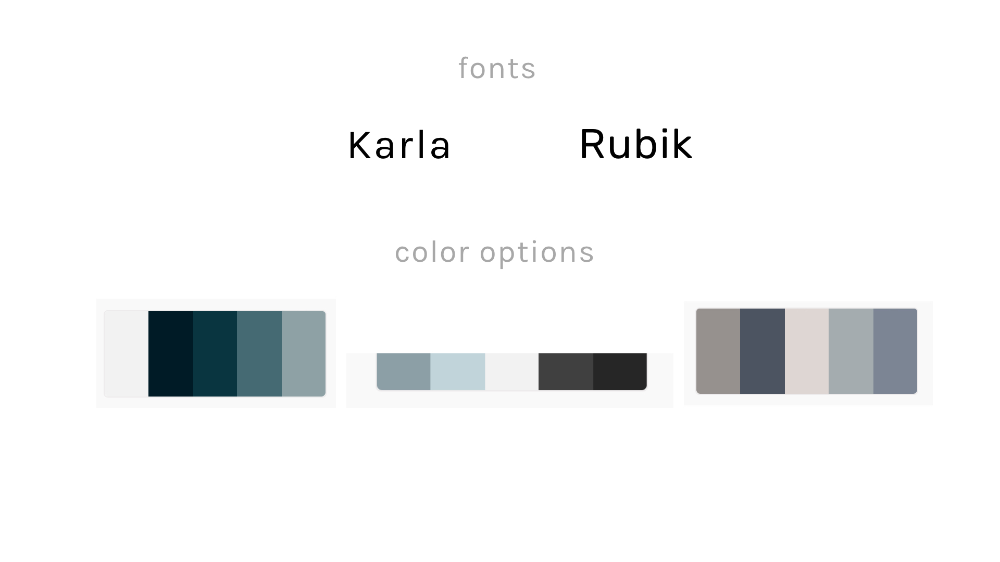

# Crud
## Connect - Resources & Unite - Developers

Our goal is to create a website that connects developers to resources and networking in their area. We want to give users access to updated resources based on personal interests and professions.

## Technologies 
Express
Node.js - EJS - Nodemon
MongoDB
Mongoose
HTML
CSS - Bootstrap

## Features
#### HOMEPAGE: 
-Welcome information
-Nav (contacts, resources calendar)
-Footer (about us, contact, social links)

#### CONTACTS:
-User profiles (FULL CRUD)
    -Name
    -Location
    -Email
    -Profession
    -Interests/Passions

#### RESOURCES:
- Websites
- Networking Events / Workshops
- Documention

#### CALENDAR: (Depending on time - FULL CRUD)
- Static Calendar 
    - Bonus (user can add, edit, & delete events)

## User Story

### USER: 
(Sprint 1)

User will navigate to Hompage and be able to create a profile with basic user information

    Page Navigation:  
        -resources 
        -contacts
        -calendar

### INFORMATION:
(Sprint 2)

User functionality to access resources, contacts, calendar. 

    Update pages:
        -resource information with links
        -static calendar events
        -contacts page 

    FULL CRUD:
        -resources

### STYLE: 
(Sprint 3)

User should have access: 
    -user friendly site 
    -appealing graphics 
    -seamless functionality
    -site information

### BONUS: 
(Sprint 4)

-Full crud on calendar
-Full crud on user profile
-Login Authentication 
-User uploaded image
-Add email pop up for user
-Add CSS animation and JS effects

### Connect
As a developer I want to stay connected to other developers in my area with similar interests. 

### Resources
I want to have daily access to resources and their updates in addition to staying informed on current technical practices. I would like to have access to documentation and syntax.

### Unite 
As a developer I would like to have access to upcoming networking events and workshops. 

### Developers 
As a developer I would like a targeted site that focuses soley on relevant developer related topics. 

## Wireframe and ERD

